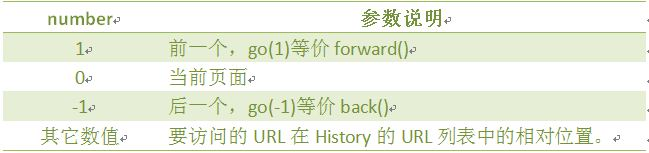
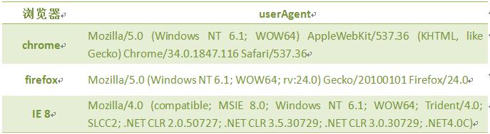
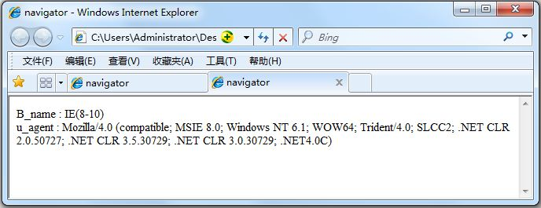

## 浏览器对象
### 一、window对象
window对象指当前的浏览器窗口。


### 二、JavaScript 计时器
在JavaScript中，我们可以在设定的时间间隔之后来执行代码，而不是在函数被调用后立即执行。

**计时器类型：**\
一次性计时器：仅在指定的延迟时间之后触发一次。\
间隔性触发计时器：每隔一定的时间间隔就触发一次。

**计时器方法：**


#### 2.1计时器setInterval()
在执行时,从载入页面后每隔指定的时间执行代码。

语法:
```
setInterval(代码,交互时间);
```
参数说明：
1. 代码：要调用的函数或要执行的代码串。
2. 交互时间：周期性执行或调用表达式之间的时间间隔，以毫秒计（1s=1000ms）。

返回值:
一个可以传递给 clearInterval() 从而取消对"代码"的周期性执行的值。\
调用函数格式(假设有一个clock()函数):\
```setInterval("clock()",1000)```
或
```setInterval(clock,1000)```

我们设置一个计时器，每隔100毫秒调用clock()函数，并将时间显示出来，代码如下:
```html
<!DOCTYPE HTML>
<html>
<head>
<meta http-equiv="Content-Type" content="text/html; charset=utf-8">
<title>计时器</title>
<script type="text/javascript">
  var int=setInterval(clock, 100)
  function clock(){
    var time=new Date();
    document.getElementById("clock").value = time;
  }
</script>
</head>
<body>
  <form>
    <input type="text" id="clock" size="50"  />
  </form>
</body>
</html>
 ```

 #### 2.2取消计时器clearInterval()

clearInterval() 方法可取消由 setInterval() 设置的交互时间。

语法：
```clearInterval(id_of_setInterval)```

参数说明:

id_of_setInterval：由 setInterval() 返回的 ID 值。
每隔 100 毫秒调用 clock() 函数,并显示时间。当点击按钮时，停止时间,代码如下:
```html
<!DOCTYPE HTML>
<html>
<head>
<meta http-equiv="Content-Type" content="text/html; charset=utf-8">
<title>计时器</title>
<script type="text/javascript">
   function clock(){
      var time=new Date();                     
      document.getElementById("clock").value = time;
   }
// 每隔100毫秒调用clock函数，并将返回值赋值给i
     var i=setInterval("clock()",100);
</script>
</head>
<body>
  <form>
    <input type="text" id="clock" size="50"  />
    <input type="button" value="Stop" onclick="clearInterval(i)"  />
  </form>
</body>
</html>
```

#### 2.3计时器setTimeout()
setTimeout()计时器，在载入后延迟指定时间后,去执行一次表达式,仅执行一次。

语法:

```setTimeout(代码,延迟时间);```

参数说明：
1. 要调用的函数或要执行的代码串。
2. 延时时间：在执行代码前需等待的时间，以毫秒为单位（1s=1000ms)。
当我们打开网页3秒后，在弹出一个提示框，代码如下:
```html
<!DOCTYPE HTML>
<html>
<head>
<script type="text/javascript">
  setTimeout("alert('Hello!')", 3000 );
</script>
</head>
<body>
</body>
</html>
//当按钮start被点击时，setTimeout()调用函数，在5秒后弹出一个提示框。
<!DOCTYPE HTML>
<html>
<head>
<script type="text/javascript">
function tinfo(){
  var t=setTimeout("alert('Hello!')",5000);
 }
</script>
</head>
<body>
<form>
  <input type="button" value="start" onClick="tinfo()">
</form>
</body>
</html>
```
要创建一个运行于无穷循环中的计数器，我们需要编写一个函数来调用其自身。在下面的代码，当按钮被点击后，输入域便从0开始计数。
```html
<!DOCTYPE HTML>
<html>
<head>
<script type="text/javascript">
var num=0;
function numCount(){
 document.getElementById('txt').value=num;
 num=num+1;
 setTimeout("numCount()",1000);
 }
</script>
</head>
<body>
<form>
<input type="text" id="txt" />
<input type="button" value="Start" onClick="numCount()" />
</form>
</body>
</html>
```
#### 2.4取消计时器clearTimeout()
setTimeout()和clearTimeout()一起使用，停止计时器。

语法:
```
clearTimeout(id_of_setTimeout)
```
参数说明:\
id_of_setTimeout：由 setTimeout() 返回的 ID 值。该值标识要取消的延迟执行代码块。\
下面的例子和上节的无穷循环的例子相似。唯一不同是，现在我们添加了一个 "Stop" 按钮来停止这个计数器：
```html
<!DOCTYPE HTML>
<html>
<head>
<script type="text/javascript">
  var num=0,i;
  function timedCount(){
    document.getElementById('txt').value=num;
    num=num+1;
    i=setTimeout(timedCount,1000);
  }
    setTimeout(timedCount,1000);
  function stopCount(){
    clearTimeout(i);
  }
</script>
</head>
<body>
  <form>
    <input type="text" id="txt">
    <input type="button" value="Stop" onClick="stopCount()">
  </form>
</body>
</html>
```
**【切记，setTimeout是一次性的，setInterval是周期性的】**
### 三、 History 对象
history对象记录了用户曾经浏览过的页面(URL)，并可以实现浏览器前进与后退相似导航的功能。\
注意:从窗口被打开的那一刻开始记录，每个浏览器窗口、每个标签页乃至每个框架，都有自己的history对象与特定的window对象关联。

语法：
```
window.history.[属性|方法]
```
注意：window可以省略。

History 对象属性


History 对象方法

使用length属性，当前窗口的浏览历史总长度，代码如下：
```html
<script type="text/javascript">
  var HL = window.history.length;
  document.write(HL);
</script>
```

#### 3.1返回前一个浏览的页面
back()方法，加载 history 列表中的前一个 URL。

语法：
```
window.history.back();
```
比如，返回前一个浏览的页面，代码如下：
```
window.history.back();
```
注意：等同于点击浏览器的倒退按钮。
back()相当于go(-1),代码如下:
```
window.history.go(-1);
```
#### 3.2返回下一个浏览的页面
forward()方法，加载 history 列表中的下一个 URL。
如果倒退之后，再想回到倒退之前浏览的页面，则可以使用forward()方法,代码如下:
```
window.history.forward();
```
注意：等价点击前进按钮。
forward()相当于go(1),代码如下:
```
window.history.go(1);
```

#### 3.3返回浏览历史中的其他页面
go()方法，根据当前所处的页面，加载 history 列表中的某个具体的页面。

语法：
```
window.history.go(number);
```
参数：

浏览器中，返回当前页面之前浏览过的第二个历史页面，代码如下：
```
window.history.go(-2);
```
注意：和在浏览器中单击两次后退按钮操作一样。
同理，返回当前页面之后浏览过的第三个历史页面，代码如下：
```
window.history.go(3);
```

### Location对象
location用于获取或设置窗体的URL，并且可以用于解析URL。

语法:
```
location.[属性|方法]
```
location对象属性图示:

location 对象属性：

location 对象方法:

```
//返回当前网页的完整url
document.write(window.location.href)
```

### 四、Navigator对象
Navigator 对象包含有关浏览器的信息，通常用于检测浏览器与操作系统的版本。

对象属性:

查看浏览器的名称和版本，代码如下:
```html
<script type="text/javascript">
   var browser=navigator.appName;
   var b_version=navigator.appVersion;
   document.write("Browser name"+browser);
   document.write("<br>");
   document.write("Browser version"+b_version);
</script>
```

#### 4.1 userAgent
返回用户代理头的字符串表示(就是包括浏览器版本信息等的字符串)

语法
```
navigator.userAgent
```
几种浏览的user_agent.，像360的兼容模式用的是IE、极速模式用的是chrom的内核。

使用userAgent判断使用的是什么浏览器(假设使用的是IE8浏览器),代码如下:

```html
<script type="text/javascript">
function validB(){ 
  var u_agent = navigator.userAgent; 
  var B_name="Failed to identify the browser"; 
  if(u_agent.indexOf("Firefox")>-1){ 
      B_name="Firefox"; 
  }else if(u_agent.indexOf("Chrome")>-1){ 
      B_name="Chrome"; 
  }else if(u_agent.indexOf("MSIE")>-1&&u_agent.indexOf("Trident")>-1){ 
      B_name="IE(8-10)";  
  }
    document.write("B_name:"+B_name+"<br>");
    document.write("u_agent:"+u_agent+"<br>"); 
} 
</script>
```
运行结果：


### 五、screen对象
screen对象用于获取用户的屏幕信息。

语法：
```
window.screen.属性
```
对象属性:


#### 5.1屏幕分辨率的高和宽
window.screen 对象包含有关用户屏幕的信息。
1. screen.height 返回屏幕分辨率的高
2. screen.width 返回屏幕分辨率的宽
注意:
1.单位以像素计。
2. window.screen 对象在编写时可以不使用 window 这个前缀。
我们来获取屏幕的高和宽，代码如下:
```html
<script type="text/javascript">
  document.write( "屏幕宽度："+screen.width+"px<br />" );
  document.write( "屏幕高度："+screen.height+"px<br />" );
</script>
```

#### 5.2屏幕可用高和宽度
1. screen.availWidth 属性返回访问者屏幕的宽度，以像素计，减去界面特性，比如任务栏。
2. screen.availHeight 属性返回访问者屏幕的高度，以像素计，减去界面特性，比如任务栏。
注意:
不同系统的任务栏默认高度不一样，及任务栏的位置可在屏幕上下左右任何位置，所以有可能可用宽度和高度不一样。

我们来获取屏幕的可用高和宽度，代码如下：
```html
<script type="text/javascript">
document.write("可用宽度：" + screen.availWidth);
document.write("可用高度：" + screen.availHeight);
</script>
```
注意:根据屏幕的不同显示值不同。