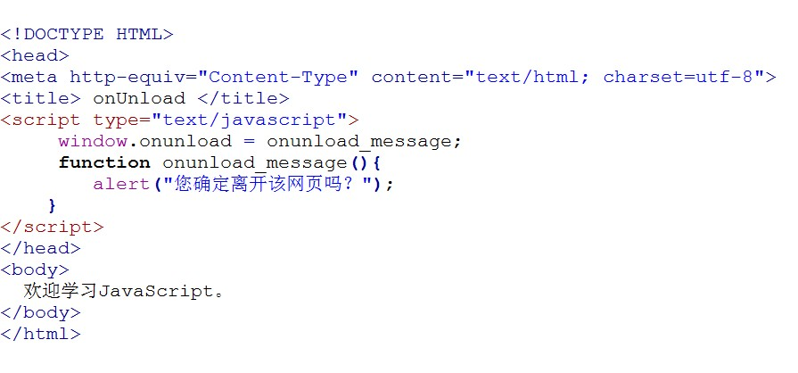
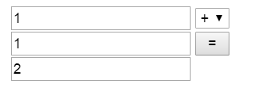

## 事件
### 简述
JavaScript 创建动态页面。事件是可以被 JavaScript 侦测到的行为。 网页中的每个元素都可以产生某些可以触发 JavaScript 函数或程序的事件。
比如说，当用户单击按钮或者提交表单数据时，就发生一个鼠标单击（onclick）事件，需要浏览器做出处理，返回给用户一个结果。

**主要事件表:**


鼠标单击事件( onclick ）</br>
鼠标经过事件（onmouseover）</br>
鼠标移开事件（onmouseout）</br>
光标聚焦事件（onfocus）</br>
失焦事件（onblur）</br>
内容选中事件（onselect）<br/>
文本框内容改变事件（onchange）<br/>
加载事件（onload）<br/>

卸载事件（onunload）<br/>



### 编程练习
>使用JS完成一个简单的计算器功能。实现2个输入框中输入整数后，点击第三个输入框能给出2个整数的加减乘除。<br/>提示：获取元素的值设置和获取方法为：例：<br/>赋值：document.getElementById(“id”）.value = 1；<br/> 取值：var = document.getElementById(“id”）.value；<br/>
任务<br/>
第一步： 创建构建运算函数count()。<br/>
第二步： 获取两个输入框中的值和获取选择框的值。<br/>
提示：document.getElementById( id名 ).value 获取或设置 id名的值。<br/>
第三步： 获取通过下拉框来选择的值来改变加减乘除的运算法则。<br/>
提示：使用switch判断运算法则。<br/>
第四步：  通过 = 按钮来调用创建的函数，得到结果。<br/>
注意: 使用parseInt()函数可解析一个字符串,并返回一个整数。


```html
<!DOCTYPE html>
<html>
 <head>
  <title> 事件</title>  
  <script type="text/javascript">
function count(){

  var $txt1=document.getElementById('txt1').value;
  var $txt2=document.getElementById('txt2').value;
  var $select=document.getElementById('select').value
  var result="";
  switch(select){
    case "+":result=parseInt($txt1) + parseInt($txt2)
    break;
    case "-":result=parseInt($txt1) + parseInt($txt2)
    break;
    case "*":result=parseInt($txt1) + parseInt($txt2)
    break;
    default :result=parseInt($txt1) + parseInt($txt2)
  }
 document.getElementById('fruit').value=result;
}

</script>
</head>
<body>
   <input type="text" id="txt1">  
   <select id="select">
     <option value="+">+</option>
     <option value="-">-</option>
     <option value="*">*</option>
     <option value="/">/</option>
   </select>
   <input type="text" id="txt2">  
   <input type="button" value= "="  onclick="count()">
   <input type="text" id="fruit">  
 </body> 
</html>
```
