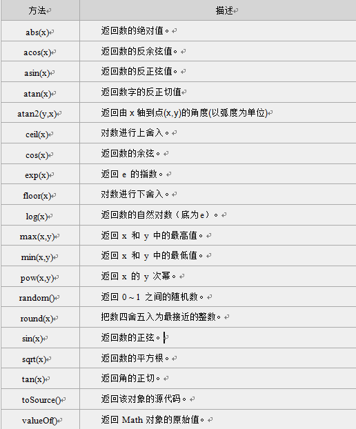

## 对象
JavaScript 中的所有事物都是对象，如:字符串、数值、数组、函数等，每个对象带有属性和方法。\
**对象的属性：** 反映该对象某些特定的性质的\
**对象的方法：** 能够在对象上执行的动作

### Date 日期对象
>定义一个时间对象 :
var Udate=new Date(); 

注意:使用关键字new，Date()的首字母必须大写。 
使 Udate 成为日期对象，并且已有初始值：当前时间(当前电脑系统时间)。
>如果要自定义初始值，可以用以下方法：\
var d = new Date(2012, 10, 1);  //2012年10月1日\
var d = new Date('Oct 1, 2012'); //2012年10月1日

Date对象中处理时间和日期的常用方法：


**eg:**\
**get/setFullYear()** 返回/设置年份，用四位数表示。
**getDay()** 返回星期，返回的是0-6的数字，0 表示星期天。\
如果要返回相对应“星期”，通过数组完成\
**get/setTime()** 返回/设置时间，单位毫秒数，计算从 1970 年 1 月 1 日零时到日期对象所指的日期的毫秒数。\
注意:1. 一小时 60 分，一分 60 秒，一秒 1000 毫秒

### String字符串对象
定义字符串的方法就是直接赋值。比如：
>var mystr = "I love JavaScript!"

**charAt()方法**可返回**指定位置**的字符。返回的字符是长度为 1 的字符串。
语法:
>stringObject.charAt(index)
```html
<script type="text/javascript">
var mystr="I love JavaScript!"//输出最后一个字符
document.write(mystr.charAt(mystr.length-1)); 
</script>
  ```
注意：\
字符串中第一个字符的下标是 0。\
最后一个字符的下标为字符串长度减一（string.length-1）。

**indexOf() 方法**可返回某个指定的字符串值在字符串中**首次**出现的位置。
>stringObject.indexOf(substring, startpos)

substring:需检索的字符串值\
startpos:指定位置开始检索

**字符串分割split()**:split() 方法将字符串分割为字符串数组，并返回此数组。
>stringObject.split(separator,limit)

使用指定符号分割字符串，代码如下:
```
var mystr = "www.imooc.com";
document.write(mystr.split(".")+"<br>");
document.write(mystr.split(".", 2)+"<br>");
```
运行结果:
```
www,imooc,com
www,imooc
```
将字符串分割为字符，代码如下：
```
document.write(mystr.split("")+"<br>");
document.write(mystr.split("", 5));
```
运行结果:
```
w,w,w,.,i,m,o,o,c,.,c,o,m
w,w,w,.,i
```
注意：\
separator:必需，从该参数指定的地方开始分割\
limit:分割的次数

**提取字符串substring()方法**用于提取字符串中介于两个指定下标之间的字符。
>stringObject.substring(startPos,stopPos) 
```
<script type="text/javascript">
  var mystr="I love JavaScript";
  document.write(mystr.substring(7));
  document.write(mystr.substring(2,6));
</script>
```
运行结果:\
JavaScript\
love

**提取指定数目的字符substr()方法** 从字符串中提取从 startPos位置开始的指定数目的字符串。
>stringObject.substr(startPos,length)
```
<script type="text/javascript">
  var mystr="I love JavaScript!";
  document.write(mystr.substr(7));
  document.write(mystr.substr(2,4));
</script>
```
运行结果：\
JavaScript!\
love

### Math对象
提供对数据的数学计算。

Math 对象属性


Math 对象方法



**向上取整ceil()方法**可对一个数进行向上取整。\
**向下取整floor()方法**可对一个数进行向下取整。
>Math.ceil(x)\
Math.floor(x)

注意：\
它返回的是大于或等于x，并且与x最接近的整数。\
它返回的是小于或等于x，并且与x最接近的整数。
```html
<script type="text/javascript">
document.write(Math.ceil(3.3)+"<br>");
document.write(Math.ceil(-0.1)+"<br>");
document.write(Math.floor(-9.9)+"<br>");
document.write(Math.floor(8.9)+"<br>");
</script>
```
运行结果：\
4\
0\
-10\
8

**四舍五入round()方法**可把一个数字四舍五入为最接近的整数。
>Math.round(x)

**随机数 random()方法**可返回介于 *0 ~ 1*（大于或等于 0 但小于 1 )之间的一个随机数。
>Math.random();


### Array 数组对象
数组对象是一个对象的集合，里边的对象可以是不同类型的。数组的每一个成员对象都有一个“下标”，用来表示它在数组中的位置，是从零开始的

一、数组定义的方法：
1. 定义了一个空数组:
>var  数组名= new Array();

2. 定义时指定有n个空元素的数组：
>var 数组名 =new Array(n);

3. 定义数组的时候，直接初始化数据：
>var  数组名 = [<元素1>, <元素2>, <元素3>...];

我们定义myArray数组，并赋值，代码如下：
>var myArray = [2, 8, 6]; 

说明：定义了一个数组 myArray，里边的元素是：myArray[0] = 2; myArray[1] = 8; myArray[2] = 6。

二、数组元素使用：
>数组名[下标] = 值;
注意: 数组的下标用方括号括起来，从0开始。

三、数组属性：
length 用法：<数组对象>.length；返回：数组的长度，即数组里有多少个元素。它等于数组里最后一个元素的下标加一。

四、数组方法：


**数组连接concat() 方法**用于连接两个或多个数组。此方法返回一个新数组，不改变原来的数组。
>arrayObject.concat(array1,array2,...,arrayN)

eg:
```
<script type="text/javascript">
  var mya = new Array(3);
  mya[0] = "1";
  mya[1] = "2";
  mya[2] = "3";
  document.write(mya.concat(4,5)+"<br>");
  document.write(mya); 
</script>
```
运行结果：\
1,2,3,4,5\
1,2,3

**指定分隔符连接数组元素join()方法**用于把数组中的所有元素放入一个字符串。元素是通过指定的分隔符进行分隔的。
>arrayObject.join(分隔符)

我们将使用分隔符来分隔数组中的元素，代码如下：
```html
<script type="text/javascript">
  var myarr = new Array(3)
  myarr[0] = "I";
  myarr[1] = "love";
  myarr[2] = "JavaScript";
  document.write(myarr.join("-"));
</script>
```
运行结果：
I-love-JavaScript

**颠倒数组元素顺序reverse() 方法**用于颠倒数组中元素的顺序。
>arrayObject.reverse()

定义数组myarr并赋值，然后颠倒其元素的顺序：
```html
<script type="text/javascript">
  var myarr = new Array(3)
  myarr[0] = "1"
  myarr[1] = "2"
  myarr[2] = "3"
  document.write(myarr + "<br />")
  document.write(myarr.reverse())
</script>
```
运行结果：\
1,2,3\
3,2,1


**选定元素slice()方法**可从已有的数组中返回选定的元素。
>arrayObject.slice(start,end)

我们将创建一个新数组，然后从其中选取的元素，代码如下：
```html
<script type="text/javascript">
  var myarr = new Array(1,2,3,4,5,6);
  document.write(myarr + "<br>");
  document.write(myarr.slice(2,4) + "<br>");
  document.write(myarr);
</script>
```
运行结果：\
1,2,3,4,5,6\
3,4\
1,2,3,4,5,6

**数组排序sort()方法**使数组中的元素按照一定的顺序排列。
>arrayObject.sort(方法函数)
```html
<script type="text/javascript">
  function sortNum(a,b) {
  return a - b;
 //升序，如降序，把“a - b”该成“b - a”
}
 var myarr = new Array("80","16","50","6","100","1");
  document.write(myarr + "<br>");
  document.write(myarr.sort(sortNum));
</script>
```
运行结果：\
80,16,50,6,100,1\
1,6,16,50,80,100